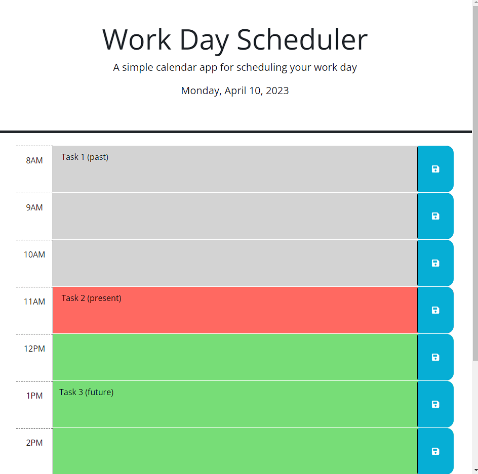

# Work Day Scheduler JavaScript & jQuery

Welcome to my JavaScript practice project using jQuery. Here, an HTML and CSS template are provided and we are tasked with building the JavaScript using various jQuery (https://learn.jquery.com/using-jquery-core/) methods and event handlers. jQuery is a third-party API that provides concise methods for traversing & manipulating the DOM; additionally, jQuery can provide "syntactic sugar" to JavaScript, reducing the at times tedious nature of accessing HTML elements in the DOM via traditional "vanilla" JavaScript.

## Usage

This project is a simple event scheduler that provides color-coded rows which dynamically change color based on the time of day. This function provides visual cues to the user to alert them of any past, present or upcoming tasks that may have been recorded in the corresponding row(s). There is also a save feature that allows the user to save their tasks to local storage, which means that those tasks will persist in memory even upon page refresh.

## Links

Please see the links below for both GitHub and the deployed page available via GitHub Pages:

GitHub: https://github.com/buster35/synevyr-lacus

GitHub Pages:

## Screenshots

## License

Please refer to the LICENSE in the repository.

